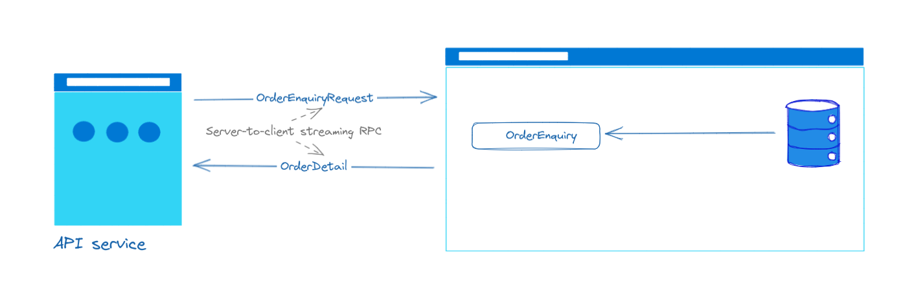

# Simple gRPC project with Java Spring
A simple project with API side and Stock service side

## 1. Functions
### 1.1 Enter order
When the API Service receives a client request, it sends it to StockTrading and waits for a response. If the order has been placed successfully, APIService will receive a new OrderUpdate message through MessageStreaming.


```proto
// ...headers
service StockTrading {
  // A Unary RPC.
  rpc enterOrder (EnterOrderRequest) returns (EnterOrderReply) {}
}

message EnterOrderRequest {
  string clientID = 1;
  string stockID = 2;
  string marketID = 3;
  int32 quantity = 4;
  double price = 5;
}

message EnterOrderReply {
  bool success = 1;
  string message = 2;
  OrderDetail orderDetail = 3;
}
```

### 1.2 Cancel order
When the API Service receives a client request, it sends the orders one by one to StockService (assuming the client wants to cancel more than one order) and waits for a response. If the order has been placed successfully, APIService will receive a new OrderUpdate message through MessageStreaming.


```proto
// ...headers
service StockTrading {
  // A client-to-server streaming RPC.
  rpc cancelOrders (stream CancelOrderRequest) returns (CancelOrderReply) {}
}

message CancelOrderRequest {
  OrderDetail orderDetail = 1;
}

message CancelOrderReplyDetail {
  OrderDetail orderDetail = 1;
  bool success = 2;
  string message = 3;
}

message CancelOrderReply {
  repeated CancelOrderReplyDetail responses = 1;
}
```

### 1.3 Order enquiry
When the API Service receives a client request, it sends it to StockService and waits for a response, API Service will then receive orders one by one from StockService.



```proto
// ...headers
service StockTrading {
  // A server-to-client streaming RPC.
  rpc orderEnquiry (OrderEnquiryRequest) returns (stream OrderDetail) {}
}

message OrderEnquiryRequest {
  string clientID = 1;
  string stockID = 2;
  string marketID = 3;
}
```

### 1.4 Order update streaming
```proto
// ...headers
service MessageStreaming {

  // A Bidirectional streaming RPC.
  rpc messageStreaming (stream MessageDetail) returns (stream MessageDetail) {}
}

message MessageDetail {
  string messageType = 1;
  string data = 2;
}
```

## 2. Compile protos
```
├── resources
│   └── proto
│       ├── common
│       │   └── common.proto
│       ├── MessageStreaming.proto
│       └── StockTrading.proto
```
Open file ./protoc.sh and update $PROTOC_HOME, then run:
```sh
$ ./protoc.sh java APIService/src/main/java common/common.proto
$ ./protoc.sh java APIService/src/main/java StockTrading.proto
$ ./protoc.sh java APIService/src/main/java MessageStreaming.proto
$ ./protoc.sh java StockService/src/main/java common/common.proto
$ ./protoc.sh java StockService/src/main/java StockTrading.proto
$ ./protoc.sh java StockService/src/main/java MessageStreaming.proto
```

## 3. Run Java projects
### 3.1. StockService
```sh
$ mvn spring-boot:run
```
`Grpc Server` listens on port `5015` (see `application.properties` -> `grpc.port` for more detail).

### 3.2. APIService
```sh
$ mvn spring-boot:run
```
`RESTful server` listens on port `8081` (see `application.properties` -> `server.port` for more detail).

Available apis:
```
curl --request POST \
  --url http://localhost:8081/api/enterOrder \
  --header 'Content-Type: application/json' \
  --data '{
	"clientID": "C123456",
	"stockID": "AAPL",
	"marketID": "NASDAQ",
	"price": "100.4",
	"qty": "10000"
}'

```
```
curl --request POST \
  --url http://localhost:8081/api/orderEnquiry \
  --header 'Content-Type: application/json' \
  --data '{
	"clientID": "C123456"
}'
```
```
curl --request POST \
  --url http://localhost:8081/api/cancelOrder \
  --header 'Content-Type: application/json' \
  --data '{
	"clientID": "C123456",
	"orders": [
		{
			"orderID": "1"
		},
		{
			"orderID": "2"
		}
	]
}'
```